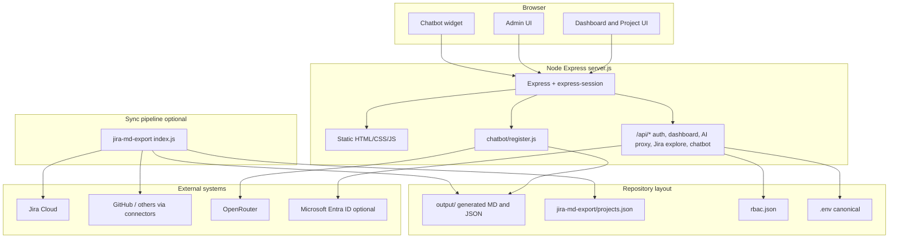

# VeloSync — Intelligent Engineering Observability Platform

VeloSync is a self-hosted **engineering observability** stack: a session-based **Express** server that serves the dashboard UI, optional **Microsoft Entra ID** (Azure AD) or **local** authentication, an **admin console** for configuration, a **RAG chatbot** grounded on exported metrics, and a **Jira → Markdown / JSON** sync pipeline (`jira-md-export`) that feeds the dashboard and chatbot.

---

## What you get

| Surface | Purpose |
|--------|---------|
| **Dashboard** (`/`, `index.html`) | Multi-team **health matrix** (delivery, flow, stability, quality, risk, AI adoption), filters, sprint context, and links into drill-downs. |
| **Project detail** (`project-detail.html` + `project-script.js`) | Per-project narrative: sprint signals, metrics, and exploration tied to data under `output/`. |
| **Explore** (`Explore/`) | Jira-backed exploration flows used from the dashboard. |
| **Admin** (`admin/`) | Branding, HTTPS, env, **projects** (`jira-md-export/projects.json`), connectors, RBAC, data-sync hints, and operational controls. |
| **Chatbot** (`chatbot/`) | **Admin-only** assistant: embeddings over `output/*.md` (and related artifacts), **OpenRouter**-backed tool use for live Jira/GitHub-style lookups, streaming answers via `/api/chatbot/ask`. |
| **Sync job** (`jira-md-export/`) | Pulls Jira (and optional connectors) into **`output/`** — Markdown reports and JSON the dashboard and chatbot consume. Can run **once** (`node index.js`) or on a **schedule** via PM2 `cron_restart`. |

---

## High-level architecture



**Data flow (short):** `jira-md-export` writes into **`output/`**. The dashboard reads those artifacts (and APIs). The chatbot **indexes** Markdown under `output/` into `chatbot/data/docs.index.json` on startup (after `npm install` in `chatbot/`). **Secrets** live only in **`.env`** (never commit).

---

## Prerequisites

- **Node.js** **20.x** or newer (LTS recommended)
- **npm** 10+
- Optional: **PM2** (`npm install -g pm2`) for production / scheduled sync
- Jira / connector credentials as needed (see `.env.example` and `jira-md-export/README.md`)

---

## Installation (clean machine)

From this repository root (the folder that contains `server.js`):

### 1. Environment

```bash
cp .env.example .env
```

Edit **`.env`**: set `SESSION_SECRET`, `PUBLIC_BASE_URL`, `PORT`, Jira fields, `OPENROUTER_API_KEY` if you use the chatbot, and Azure fields if `AUTH_MODE=azure`.

> **Canonical env:** the root **`.env`** is the source of truth. A legacy `jira-md-export/.env` is optional; if both exist, the root file **wins** on conflicts (see `server.js`).

### 2. Install dependencies (three places)

```bash
npm install
cd chatbot && npm install && cd ..
cd jira-md-export && npm install && cd ..
```

### 3. RBAC and first login

`rbac.json` ships with **no local users**. On first start, with **`AUTH_MODE=local`** (default), the app **bootstraps** a local admin:

- **Username:** `admin`  
- **Password:** `admin`  

Change this immediately (**Admin → users** or by editing `rbac.json` through the admin API).

For **Microsoft Entra ID**, set `AUTH_MODE=azure` and fill `AZURE_*` and redirect URIs per `.env.example`.

### 4. Projects and sync

1. Edit **`jira-md-export/projects.json`** for your Jira boards/projects (see `jira-md-export/README.md`).
2. Run a first export:

   ```bash
   cd jira-md-export
   node index.js
   cd ..
   ```

   Generated files appear under **`output/`**.

### 5. TLS (optional, local dev)

Self-signed for local HTTPS:

```bash
npm run gen-cert
```

Then enable `USE_HTTPS`, `SSL_KEY_PATH`, and `SSL_CERT_PATH` in `.env` as documented in `.env.example`.

---

## Run the server

**Foreground:**

```bash
npm start
```

Open **http://localhost:3000** (or your configured `PUBLIC_BASE_URL`).

**Development:** same as start — `npm run dev` also runs `node server.js`.

---

## PM2 (production + nightly sync)

The included **`ecosystem.config.cjs`** defines:

1. **`velosync-web`** — `server.js` (dashboard + APIs + chatbot mount).
2. **`velosync-sync`** — `jira-md-export/index.js` with **`cron_restart: "0 0 * * *"`** (daily at midnight server local time).

From the repo root:

```bash
pm2 start ecosystem.config.cjs
pm2 save
pm2 status
```

**Linux** (systemd-style persistence):

```bash
pm2 startup
# run the command PM2 prints, then:
pm2 save
```

**Windows Server:** see [PM2 Windows startup](https://pm2.keymetrics.io/docs/usage/startup/) if you need reboot persistence.

To run **only** the web app under PM2:

```bash
pm2 start server.js --name velosync-web
```

---

## Repository layout (quick reference)

| Path | Role |
|------|------|
| `server.js` | Express entry, auth, APIs, static routes, chatbot registration. |
| `lib/` | Auth, admin routes, branding, connectors, OpenRouter proxy, etc. |
| `js/`, `css/`, `*.html` | Dashboard and project UI assets. |
| `admin/` | Admin SPA (settings, env, projects, RBAC). |
| `output/` | **Generated** — populated by `jira-md-export` (gitignored except `.gitkeep`). |
| `jira-md-export/` | Sync CLI + `projects.json` + connector modules. |
| `chatbot/` | Embeddings, agent, `/api/chatbot/*`, static widget under `/chatbot/ui`. |
| `data/` | Runtime connector toggles and similar (see repo). |
| `rbac.json` | Roles + local user hashes (do not commit production secrets). |
| `METRICS.md` | In-product metrics reference (served at `/METRICS.md`). |

---

## Security notes for public deployment

- Never commit **`.env`**, real **`rbac.json`** password hashes you care about, or **TLS private keys**.
- Rotate any API keys that ever appeared in a private copy before open-sourcing.
- Prefer **reverse proxy TLS** (nginx, Caddy) in production and keep `USE_HTTPS` off behind the proxy unless you terminate TLS on Node intentionally.

---

## Further reading

- **`APP-SETUP.md`** — focused setup notes.
- **`jira-md-export/README.md`** — export pipeline, connectors, env.
- **`chatbot/README.md`** — chatbot architecture, models, and data paths.

---

## License

This project is released under the **MIT License** — see [LICENSE](LICENSE) in the repository root.
