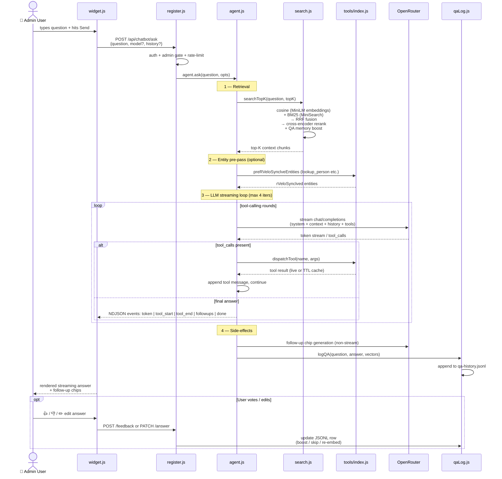
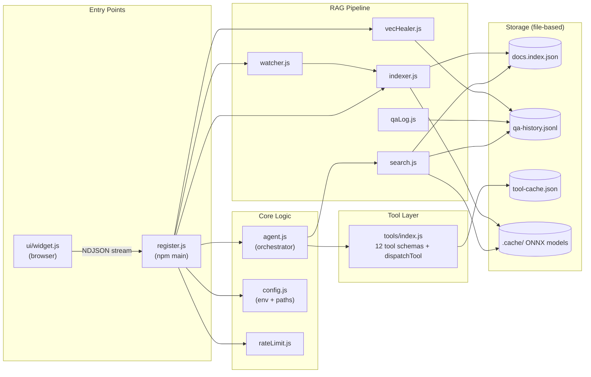

# Chatbot Module

Self-contained RAG assistant for the dashboard. Lives entirely in this folder.

---

## Architecture

### System Overview

```mermaid
graph TB
    subgraph Browser["🌐 Browser (Admin Only)"]
        W["widget.js\n(Vanilla JS FAB + stream renderer)"]
        SH["standalone.html\n(pop-out / fullscreen)"]
    end

    subgraph Host["🖥️ Host App  —  server.js"]
        Auth["requireAuth / requireAdmin\n/ isAdmin / openRouterFetch"]
    end

    subgraph Chatbot["📦 chatbot/ — Self-contained Module"]
        REG["register.js\n(Express mount + warmup)"]
        AGENT["agent.js\n(Turn orchestrator + streamer)"]
        CFG["config.js\n(Env + paths)"]
        RL["rateLimit.js\n(Token-bucket middleware)"]

        subgraph Embeddings["🔍 embeddings/"]
            IDX["indexer.js\n(Chunk → Embed → Index)"]
            SRC["search.js\n(Hybrid cosine + BM25 + RRF + Rerank)"]
            WCH["watcher.js\n(chokidar live delta)"]
            QAL["qaLog.js\n(JSONL append / rotate)"]
            VH["vecHealer.js\n(Backfill null vectors)"]
        end

        subgraph Tools["🛠️ tools/index.js"]
            T1["lookup_person / list_people"]
            T2["query_jira / query_github_pr"]
            T3["query_copilot / query_cursor"]
            T4["query_confluence / query_testrail"]
            T5["query_sprint / list_projects"]
        end

        subgraph UI["🎨 ui/"]
            WJS["widget.js"]
            WCSS["widget.css"]
            SHTML["standalone.html"]
        end

        subgraph Data["💾 data/"]
            DIDX["docs.index.json\n(chunk vectors)"]
            QALOG["qa-history.jsonl\n(conversation memory)"]
        end

        subgraph Cache[".cache/"]
            TC["tool-cache.json\n(per-tool TTL)"]
            ONNX["Xenova ONNX models\n(MiniLM-L6-v2 · ms-marco reranker)"]
        end
    end

    subgraph External["☁️ External Services"]
        OR["OpenRouter API\n(claude-sonnet-4-5 / any model)"]
        JIRA["Atlassian JIRA REST"]
        GH["GitHub REST + Search"]
        CONF["Confluence REST"]
        TR["TestRail API"]
    end

    subgraph Files["📂 Shared Read-Only Files  (../output/ + ../jira-md-export/)"]
        MD["output/*.md\n(sprint reports)"]
        RD["output/rVeloSyncurce-directory.json"]
        CP["output/copilotdata.json"]
        CUR["output/cursordata.json"]
        PROJ["jira-md-export/projects.json"]
        ENV2["jira-md-export/.env\n(JIRA · GitHub · TestRail creds)"]
    end

    %% Browser ↔ Host
    W -->|"POST /api/chatbot/ask (NDJSON stream)\nPOST /api/chatbot/feedback\nPATCH /api/chatbot/answer\nGET  /chatbot/ui/*"| REG
    SH --> W

    %% Host → Chatbot
    Host -->|"register(app, deps)"| REG
    Auth -.->|"injected deps"| REG

    %% Register → internals
    REG --> AGENT
    REG --> IDX
    REG --> WCH
    REG --> VH
    REG --> RL
    REG --> CFG

    %% Agent core loop
    AGENT -->|"searchTopK"| SRC
    AGENT -->|"dispatchTool"| Tools
    AGENT -->|"streaming chat/completions"| OR
    AGENT -->|"logQA"| QAL

    %% Embeddings internals
    SRC --> DIDX
    SRC --> QALOG
    SRC --> ONNX
    IDX --> DIDX
    IDX --> ONNX
    WCH -->|"delta reindex"| IDX
    QAL --> QALOG
    VH --> QALOG

    %% Tools → external + files
    T1 & T2 & T3 & T4 & T5 --> TC
    T2 --> JIRA
    T2 --> GH
    T4 --> CONF
    T4 --> TR
    T1 --> RD
    T3 --> CP
    T3 --> CUR
    T5 --> PROJ

    %% File sources
    MD -->|"embed on boot + delta"| IDX
    ENV2 -.->|"dotenv"| CFG
    PROJ --> T5

    %% UI assets
    UI --> REG
```



---

### Ask Request — Data Flow



---

### Component Map



---

## What it does

- Floating-bubble chat widget in the bottom-right of every dashboard page (admin-only).
- **Hybrid retrieval** over the sprint markdown reports in `../output/*.md`:
  - Cosine search using local Xenova MiniLM-L6-v2 embeddings (CPU, no GPU/external service).
  - BM25 keyword search via `minisearch` (catches JIRA keys, project names, logins that pure cosine can miss).
  - Reciprocal Rank Fusion over both, then a Xenova **cross-encoder re-ranker** (`ms-marco-MiniLM-L-6-v2`) for top-K relevance.
- **Live index updates** via `chokidar` file watcher on `../output/*.md` — daily cron refreshes are picked up within 5 s without restarting the server. True delta indexing (per-file mtime map) re-embeds only changed files and drops chunks of deleted files.
- **OpenRouter tool-calling agent** with **12 tools** and up to **6 tool-call rounds** (see below).
- **Token-by-token streaming** of the final answer to the widget.
- **Intelligence upgrades (v3 index):**
  - **Contextual Retrieval** — each chunk is embedded with a metadata prefix (`[Project | Sprint | Section]`) prepended, so vectors capture *where* a fact lives as well as *what* it says. Optional LLM-powered context via `CHATBOT_CONTEXTUAL_RETRIEVAL=llm`.
  - **Query Rewriting + HyDE** — before retrieval, the fast model generates 2 alternative phrasings of the question and a "hypothetical sprint-report answer". All variants are embedded and their scores fused via multi-query RRF, dramatically improving recall for short/ambiguous queries.
  - **Intent-based Tool Router** — on the first tool-calling round, only the tools relevant to the query domain (people / sprint+JIRA / GitHub / AI adoption / TestRail / Confluence) are exposed, reducing hallucinated tool calls and token overhead.
  - **Parallel Tool Dispatch** — when the model requests multiple tools in one round, they are dispatched with `Promise.all` instead of sequentially, cutting wait time proportionally.
  - **Persistent User Memory** — after each conversation the fast model extracts 1-3 facts about the user (their role, projects, concerns) and persists them to `data/user-memory.jsonl`. Future sessions inject these facts into the system prompt automatically.
  - **Sliding Context Window** — conversations longer than `CHATBOT_HISTORY_COMPRESS_TURNS` turns are automatically summarised so older context is preserved in a compact block without blowing the context window.
- **Self-learning conversation memory**:
  - Every successful Q+A is embedded and appended to `data/qa-history.jsonl`.
  - Per-message **thumbs up/down** votes are persisted; helpful rows are boosted in retrieval, unhelpful rows are skipped.
  - **Edit-this-answer** lets a user correct a wrong answer; the corrected version is re-embedded and replaces the row as new ground truth.
- **Follow-up question chips** are generated after every answer and appear under the assistant bubble (clicking fills the input — no auto-send).
- **Tool-result caching** with per-tool TTLs (Copilot/Cursor 24h, JIRA 1m, person lookup 1h, etc.) backed by `chatbot/.cache/tool-cache.json`. Errors are never cached.

## Tools (12)

| Tool | Source | Use case |
|---|---|---|
| `lookup_person` | `output/rVeloSyncurce-directory.json` (fuzzy match) | RVeloSynclve a name to email + JIRA accountId + GitHub login |
| `list_people` | `output/rVeloSyncurce-directory.json` (bulk) | "Who is on team X", "list QA managers" without retrieval |
| `query_jira` | live JIRA REST | "Open tickets for X", "what's in HDE this sprint", JQL queries |
| `query_github` | live GitHub search (+ `getGitHubMetricsForUser` on richMetrics) | Recent PRs / commits for one person |
| `query_copilot` | cached `output/copilotdata.json` | Copilot leaderboard, lines accepted, acceptance rate |
| `query_cursor` | cached `output/cursordata.json` | Cursor leaderboard, model/language/work share, per-repo edits |
| `query_confluence` | live Confluence REST via `getConfluenceActivityForUser` | Pages contributed/created by a person |
| `query_testrail` | live TestRail via `getTestRailMetrics` | Runs, cases, plans, automation coverage per project |
| `query_sprint` | `output/*.md` (deterministic) | "Show me the full HDE Sprint 47 report" — verbatim, no embeddings |
| `query_jira_issue` | live JIRA REST | Full detail for one ticket — description, comments, subtasks, sprint |
| `query_github_pr` | live GitHub REST | Full detail for one PR — files, reviews, comments, merge state |
| `list_projects` | `jira-md-export/projects.json` (deterministic) | Enumerate projects, keys, managers, TestRail IDs |

## What it depends on (read-only)

- `../jira-md-export/.env` — JIRA, GitHub, Confluence (shares JIRA creds), TestRail, ENT (Copilot enterprise). Read via `dotenv` with an explicit path. Never copied, never written.
- `../jira-md-export/get-github-metrics.js`, `get-confluence-data.js`, `get-testrail-data.js` — imported via dynamic `import()` for live tool calls.
- `../output/*.md` — sprint reports (for embedding + `query_sprint`).
- `../output/rVeloSyncurce-directory.json` — for the person lookup + `list_people`.
- `../output/copilotdata.json`, `cursordata.json` — refreshed by the daily `node jira-md-export/index.js` run; read directly by the tools.
- `../jira-md-export/projects.json` — for rVeloSynclving project name → TestRail project IDs and `list_projects`.
- Root `.env` — for `OPENROUTER_API_KEY` (already loaded by `server.js` at startup).
- `../server.js` injects `requireAuth` and `openRouterFetch` into our `register(app, deps)` entry point.

Nothing reverse-imports from this module.

## Install

```bash
cd chatbot
npm install
```

This installs the runtime dependencies (`@xenova/transformers`, `chokidar`, `minisearch`) into `chatbot/node_modules/` (separate from the parent project's `node_modules/`).

## Configuration

No new credentials. Optional knobs in the root `.env`:

| Var | Default | Notes |
|---|---|---|
| `CHATBOT_MODEL` | `anthropic/claude-sonnet-4.6` | Default OpenRouter model when none is sent in the request body |
| `CHATBOT_FAST_MODEL` | `google/gemini-flash-1.5` | Cheap model for sub-tasks: query rewriting, HyDE, history compression, memory extraction |
| `CHATBOT_TOP_K` | `5` | Final number of chunks injected into the prompt |
| `CHATBOT_CANDIDATE_K` | `20` | Pre-rerank candidate pool size (cosine + BM25 each) |
| `CHATBOT_MAX_ITERS` | `6` | Max tool-calling round trips per question (was 4) |
| `CHATBOT_RERANKER_MODEL` | `Xenova/ms-marco-MiniLM-L-6-v2` | Cross-encoder model id |
| `CHATBOT_DISABLE_HYBRID` | `0` | Set `1` to disable BM25, cosine-only |
| `CHATBOT_DISABLE_RERANKER` | `0` | Set `1` to skip cross-encoder rerank |
| `CHATBOT_DISABLE_TOOL_CACHE` | `0` | Set `1` to bypass tool result caching |
| `CHATBOT_DISABLE_WATCHER` | `0` | Set `1` for boot-only indexing (no live deltas) |
| `CHATBOT_FOLLOWUP_MODEL` | _(same as chosen model)_ | Override for the cheap follow-up question generator |
| `CHATBOT_CONTEXTUAL_RETRIEVAL` | `metadata` | `metadata` = free deterministic prefix, `llm` = LLM-generated context sentence per chunk, `off` = raw text |
| `CHATBOT_DISABLE_QUERY_REWRITE` | `0` | Set `1` to disable query rewriting + HyDE (uses single query retrieval) |
| `CHATBOT_DISABLE_USER_MEMORY` | `0` | Set `1` to disable persistent per-user memory extraction and injection |
| `CHATBOT_HISTORY_COMPRESS_TURNS` | `8` | Compress conversation history into a summary after this many turns |

JIRA/GitHub credentials come from `../jira-md-export/.env` (see that folder's README for setup).

## API surface added to the host app

`register(app, deps)` mounts:

- `GET  /chatbot/ui/*`         — static widget assets, admin-only (silent stub for non-admins)
- `POST /api/chatbot/ask`      — NDJSON-streaming agent endpoint (admin-only)
- `POST /api/chatbot/feedback` — body `{ id, helpful: bool|null }` to vote on a previously logged QA row
- `PATCH /api/chatbot/answer`  — body `{ id, answer }` to overwrite a row's answer with a user-corrected version

All four require auth + admin gate; ownership is enforced server-side (you can only vote/edit your own rows).

## Removal procedure (zero residue)

1. Delete the `chatbot/` folder.
2. Remove the 2-line `register(app, ...)` block from `../server.js`.
3. Remove the `<script src="/chatbot/ui/widget.js">` line from `../index.html` and `../project-detail.html`.
4. Remove the chatbot block (5 lines) from `../.gitignore`.
5. (Optional) Remove the `CHATBOT_*` comment block from `../.env.example`.

The shared model registry (`js/openrouter-allowlist.json`, `js/model-picker.js`, `GET /api/openrouter/models`) is **independent** and stays — it's used by the main dashboard, not just the chatbot.
